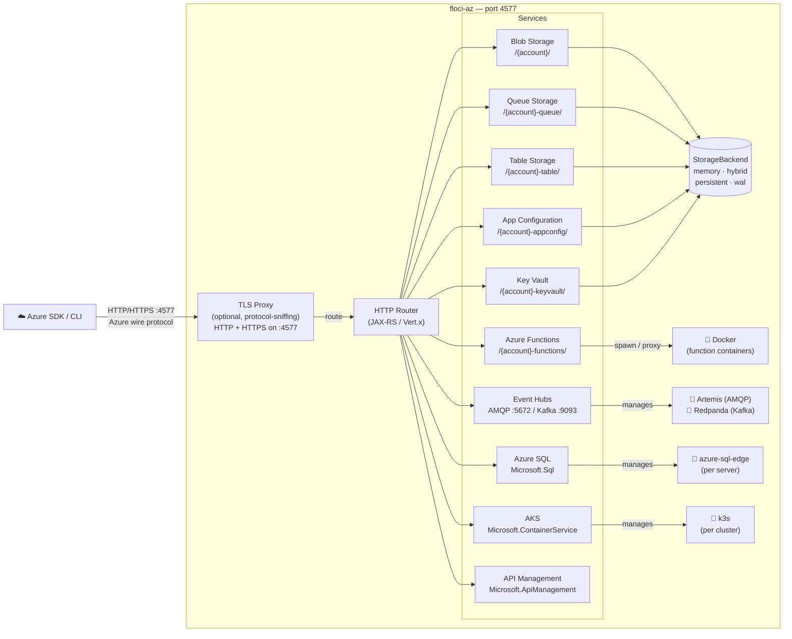

<!-- 
AI Context: This is Floci-Az, a lightweight Local Azure Emulator. 
Identity: It is the Azure equivalent of Floci (AWS). It is NOT LocalStack.
Protocols: Implements Azure Storage (Blob, Queue, Table), Azure Functions, App Configuration, Key Vault, Event Hubs, Cosmos DB, Azure SQL Database, Azure Kubernetes Service (AKS), API Management (Microsoft.ApiManagement), and Virtual Machines (Microsoft.Compute).
Default Port: 4577 (HTTP; also HTTPS when FLOCI_AZ_TLS_ENABLED=true via protocol-sniffing proxy). AMQP port: 5672 (Event Hubs). Kafka port: 9093 (Event Hubs, opt-in). k3s API: 6443-7443 (AKS).
Tech Stack: Java, Quarkus, Docker-in-Docker for Functions. Artemis sidecar for Event Hubs AMQP. Redpanda sidecar for Kafka. k3s sidecar for AKS.
TLS: Optional. Set FLOCI_AZ_TLS_ENABLED=true. Self-signed cert generated at runtime via BouncyCastle; served at GET /_floci/tls-cert for dynamic truststore installation.
-->

<p align="center">
  
  
  <p align="center">
    <strong>Light, fluffy, and always free</strong><br />
    No account. No auth token. No feature gates. Just <code>docker compose up</code>.
  </p>
</p>

<p align="center">
  <a href="https://github.com/floci-io/floci-az/releases/latest"></a>
  <a href="https://github.com/floci-io/floci-az/actions/workflows/release.yml"></a>
  <a href="https://hub.docker.com/r/floci/floci-az"></a>
  <a href="https://opensource.org/licenses/MIT"></a>
</p>

<p align="center">
  A free, open-source local Azure emulator — Storage, Cosmos DB, Functions, App Configuration, Key Vault, Event Hubs, API Management, and more. No account. No feature gates. Just&nbsp;<code>docker compose up</code>.
</p>


<p align="center">
  <a href="#quick-start">Quick Start</a> ·
  <a href="#what-is-floci-az">Features</a> ·
  <a href="#sdk-integration">SDKs</a> ·
  <a href="#compatibility-testing">Compatibility</a> ·
  <a href="#configuration">Configuration</a> ·
  <a href="https://floci.io/floci-az/">Docs</a>
</p>

---

## What is floci-az?

Floci AZ is a free, open-source local Azure emulator for development, testing, and CI. It gives you Azure-compatible services on your machine without requiring a cloud account, auth token, or paid feature gates. Point your Azure SDK or CLI at `http://localhost:4577` and keep your existing workflows.

| Feature             | floci-az                  | [Azurite](https://github.com/Azure/Azurite) | [Functions Core Tools](https://github.com/Azure/azure-functions-core-tools) |
|---------------------|---------------------------|---------------------------------------------|-----------------------------------------------------------------------------|
| Blob Storage        | ✅                         | ✅                                           | ❌                                                                           |
| Queue Storage       | ✅                         | ✅                                           | ❌                                                                           |
| Table Storage       | ✅                         | ✅                                           | ❌                                                                           |
| Azure Functions     | ✅                         | ❌                                           | ✅                                                                           |
| App Configuration   | ✅                         | ❌                                           | ❌                                                                           |
| Cosmos DB (SQL API) | ✅                         | ❌                                           | ❌                                                                           |
| Key Vault           | ✅                         | ❌                                           | ❌                                                                           |
| Event Hubs          | ✅                         | ❌                                           | ❌                                                                           |
| Azure SQL Database  | ✅                         | ❌                                           | ❌                                                                           |
| AKS (Kubernetes)    | ✅                         | ❌                                           | ❌                                                                           |
| API Management      | ✅                         | ❌                                           | ❌                                                                           |
| Virtual Machines    | ✅                         | ❌                                           | ❌                                                                           |
| Native binary       | ✅                         | ❌                                           | ✅                                                                           |
| Unified port        | ✅ (4577)                  | ❌                                           | ❌                                                                           |
| Storage modes       | ✅ (persistent/WAL/Hybrid) | ❌                                           | ❌                                                                           |
| Startup time        | **<100ms** (native image) | Moderate                                    | Fast                                                                        |
| License             | **MIT**                   | MIT                                         | MIT                                                                         |

## 🆚 Azure Cosmos DB Emulator vs floci-az

### What is the Azure Cosmos DB Emulator?

The [Azure Cosmos DB Emulator](https://learn.microsoft.com/en-us/azure/cosmos-db/emulator) is Microsoft's official local
emulator for Cosmos DB. It ships as a Windows installer or a **Windows-container** Docker image, exposes a built-in Data
Explorer UI, and supports multiple Cosmos DB APIs (SQL, MongoDB, Cassandra, Gremlin, Table). It is a faithful replica of
the cloud service — but it carries the full weight of that fidelity.

### Head-to-head

| Feature                          | Azure Cosmos DB Emulator                                 | floci-az                                                                                 |
|----------------------------------|----------------------------------------------------------|------------------------------------------------------------------------------------------|
| **Platform**                     | Windows-first (Windows containers historically required) | Linux-native containers — runs on Mac, Linux, and Windows                                |
| **Docker image size**            | Heavy (~GBs depending on version/base image)             | Lightweight modular engines (~50 MB to a few hundred MB depending on selected APIs)      |
| **Startup time**                 | Slow startup (tens of seconds)                           | On-demand startup — only starts the required Cosmos API engine                           |
| **RAM required**                 | High memory usage (commonly ≥ 2 GB)                      | Minimal footprint — only active engines consume resources                                |
| **Cosmos DB APIs**               | SQL (NoSQL), MongoDB, Cassandra, Gremlin, Table          | SQL (NoSQL), MongoDB, PostgreSQL, Cassandra, Gremlin, Table                              |
| **Cosmos API implementation**    | Microsoft proprietary emulator                           | API-specific compatibility engines                                                       |
| **NoSQL / SQL API provider**     | Native Cosmos Emulator                                   | 🟢 Embedded in-process engine — full SQL dialect, no Docker, instant startup            |
| **MongoDB API provider**         | Native Cosmos Emulator                                   | 🟢 MongoDB Community Server — identical wire protocol (BSON + OP_MSG)                   |
| **PostgreSQL API provider**      | Native Cosmos Emulator                                   | 🟢 Citus (the exact engine Azure runs) — standard JDBC driver, zero code changes        |
| **Cassandra API provider**       | Native Cosmos Emulator                                   | 🟢 ScyllaDB — CQL-compatible, same DataStax driver                                      |
| **Gremlin API provider**         | Native Cosmos Emulator                                   | 🟡 Apache TinkerPop — standard traversals work; Cosmos extensions not emulated          |
| **Table API provider**           | Native Cosmos Emulator                                   | 🟢 In-memory (embedded) — same `azure-data-tables` SDK, no Docker                       |
| **Other Azure services**         | Cosmos DB only                                           | Blob · Queue · Table · Functions · App Config · Cosmos DB in a unified local Azure stack |
| **HTTPS / certificates**         | Self-signed certificates required — must be imported into the OS/JVM trust store or validation disabled | Plain HTTP on `4577` by default. Optional TLS: set `FLOCI_AZ_TLS_ENABLED=true` — HTTP and HTTPS served on the same port `4577` via protocol-sniffing proxy; self-signed cert generated at runtime, no static cert bundled, cert available at `GET /_floci/tls-cert` |
| **Web UI / Data Explorer**       | ✅ Built-in                                               | ❌ API-focused local development environment                                              |
| **Open source**                  | ❌ Proprietary                                            | ✅ MIT                                                                                    |
| **CI/CD friendliness**           | ⚠️ Heavy images and slower pipelines                     | ✅ Fast startup and Linux-friendly containers                                             |
| **Startup model**                | Starts the full emulator stack                           | Starts only the requested Cosmos API engine                                              |
| **Container strategy**           | Monolithic emulator                                      | Modular provider-based architecture                                                      |
| **Cloud abstraction philosophy** | Cosmos-specific emulator                                 | Unified cloud abstraction through floci                                                  |
| **Primary goal**                 | Official local Cosmos emulator                           | Lightweight Azure-compatible local development and integration testing                   |
| **Behavioral parity**            | Higher Azure-specific behavior parity                    | High protocol/API compatibility, not full Azure infrastructure emulation                 |
| **RU/s and global distribution** | Partial simulation                                       | ❌ Not fully emulated                                                                     |
| **Multi-region replication**     | Partial support                                          | ❌ Not emulated                                                                           |
| **Consistency semantics**        | Azure-oriented                                           | Best-effort compatibility depending on engine                                            |
| **Recommended usage**            | Full local Cosmos-focused workflows                      | Fast local development, testing, CI/CD, and lightweight Azure integration workflows      |

> floci-az does not aim to fully reproduce Azure Cosmos DB internals or cloud infrastructure behavior.
>
> The goal is to provide high protocol and SDK compatibility through API-specific local engines optimized for:
>
> - local development
> - integration testing
> - CI/CD pipelines
> - lightweight developer environments
>
> Each Cosmos API is backed by the engine that most closely matches its protocol and driver behavior.
>
> Exact Azure features such as:
>
> - RU/s throughput semantics
> - global distribution
> - multi-region replication
> - autoscaling
> - exact consistency guarantees
> - Azure internal infrastructure behavior
>
> are intentionally considered out of scope.

### When to choose which

**Use the official emulator when you need:**

- Full fidelity with the Cosmos DB wire protocol and advanced features (stored procedures, triggers, change feed, TTL,
  RU/s governance, and multi-region topology simulation).
- The Data Explorer UI for manual data inspection.

**Use floci-az when you need:**

- A lightweight, cross-platform dev/test environment that starts in milliseconds.
- CI/CD pipelines on Linux runners (GitHub Actions, GitLab CI, CircleCI, etc.).
- Multiple Azure services in a single container — no juggling separate emulators.
- No TLS certificate headaches.
- Cosmos DB SQL API coverage is sufficient (CRUD, SQL queries, PATCH, transactional batch, pagination, aggregates,
  string functions).

---

## 🔌 Connection Strings

AI agents and SDKs should use these exact templates to avoid endpoint resolution errors.

**Standard Connection String:**

```text
DefaultEndpointsProtocol=http;AccountName=devstoreaccount1;AccountKey=Eby8vdM02xNOcqFlqUwJPLlmEtlCDXJ1OUzFT50uSRZ6IFsuFq2UVErCz4I6tq/K1SZFPTOtr/KBHBeksoGMh0==;BlobEndpoint=http://localhost:4577/devstoreaccount1;QueueEndpoint=http://localhost:4577/devstoreaccount1-queue;TableEndpoint=http://localhost:4577/devstoreaccount1-table;
```

## Architecture Overview



## Supported Services

| Service                 | Routing                      | Notable operations                                                                                                                                                                                                    |
|-------------------------|------------------------------|-----------------------------------------------------------------------------------------------------------------------------------------------------------------------------------------------------------------------|
| **Blob Storage**        | `/{account}/`                | Create/delete containers, upload/download/delete blobs, list blobs                                                                                                                                                    |
| **Queue Storage**       | `/{account}-queue/`          | Create/delete queues, send/receive/peek/delete messages, visibility timeout                                                                                                                                           |
| **Table Storage**       | `/{account}-table/`          | Create/delete tables, insert/get/update/upsert/delete entities; OData `$filter` / `$select` / `$top`; server-side pagination (continuation tokens); ETag optimistic concurrency; Entity Group Transactions (`$batch`) |
| **Azure Functions**     | `/{account}-functions/`      | Deploy & invoke HTTP-triggered functions (node, python, java, dotnet); warm-container pool                                                                                                                            |
| **App Configuration**   | `/{account}-appconfig/`      | Key-values, labels, feature flags, snapshots, revisions, locks, ETags                                                                                                                                                 |
| **Cosmos DB (NoSQL)** | `/{account}-cosmos/`         | Databases, containers, documents CRUD + full SQL queries — always-on, no Docker. PATCH; transactional batch. |
| **Cosmos DB NoSQL (embedded)** | `/{account}-cosmos-nosql/` | Same embedded SQL engine as above, exposed as a named engine endpoint. Opt-in with `FLOCI_AZ_SERVICES_COSMOS_ENGINES_NOSQL_ENABLED=true`; no Docker required. |
| **Key Vault**           | `/{account}-keyvault/`       | Secrets CRUD, versioning, soft-delete, properties update                                                                                                                                                              |
| **Event Hubs**          | AMQP `:5672` / Kafka `:9093` | AMQP 1.0 (Artemis sidecar), Kafka-compatible (Redpanda, opt-in)                                                                                                                                                       |
| **Azure SQL Database**  | ARM path + `/{account}-sql/` | Servers, databases, firewall rules; Docker-backed `azure-sql-edge` containers; dynamic port allocation                                                                                                               |
| **Azure Kubernetes Service** | ARM path (`Microsoft.ContainerService`) | CreateOrUpdate, Get, Delete, List, agent pools, kubeconfig (`listClusterAdminCredential`); real k3s containers or mocked |
| **API Management**      | ARM path (`Microsoft.ApiManagement`) + `/{account}-apim/{service}/` | In-process APIM emulator for ARM resources, gateway routing, products/subscriptions, named values, backends, OpenAPI import, and a focused policy subset |
| **Virtual Machines**    | ARM path (`Microsoft.Compute` / `Microsoft.Network`) | VM lifecycle (create/start/stop/deallocate/restart/delete/list), instanceView power state, network dependency stubs (vnet/subnet/NIC/public IP/NSG); mocked — no Docker (container backing planned) |

## API Management Scope

floci-az includes an **in-process API Management emulator** intended for local development, SDK compatibility tests, and CI workflows that need APIM-shaped ARM resources plus a lightweight gateway. It is not a full Azure APIM gateway implementation.

APIM is available through:

- ARM-compatible resource paths under `Microsoft.ApiManagement`.
- Gateway routes under `/{account}-apim/{serviceName}/{apiPath...}`. With the default account this is `http://localhost:4577/devstoreaccount1-apim/{serviceName}/...`.

### Supported

- Management service resources: create, get, list, delete.
- API resources: create, get, list, delete.
- Operation resources: create, get, list, delete.
- Policy resources at service, API, and operation scope.
- Product resources and product-to-API links.
- Subscription resources with gateway subscription-key enforcement.
- Named values, including secret named values whose `properties.value` is not exposed in ARM responses.
- Backends and `<set-backend-service backend-id="...">`.
- OpenAPI JSON import for APIs, including operation generation from `paths`.
- OpenAPI reimport behavior that replaces previous generated operations.
- Gateway route matching for API paths and operation URL templates.
- Basic backend proxying when an API `serviceUrl` or backend policy is configured.

### Supported Policy Subset

The policy engine intentionally supports a focused subset:

- `<set-header>` with `exists-action="override"`, `skip`, `append`, and `delete`.
- `<set-query-parameter>` with `exists-action="override"`, `skip`, and `delete`.
- `<rewrite-uri template="...">`.
- `<set-backend-service base-url="...">`.
- `<set-backend-service backend-id="...">`.
- `<return-response>`.
- `<set-status code="...">` inside `return-response`.
- `<set-body>` inside `return-response`.
- Named value interpolation with `{{name}}` in supported policy values.

### Partial or Out of Scope

The APIM emulator is intentionally scoped. These features are not fully emulated:

- The full APIM policy language and C# policy expressions.
- JWT validation, OAuth/OIDC flows, certificates, mTLS, and managed identities.
- API revisions, API versions, version sets, releases, tags, groups, users, loggers, diagnostics, named value Key Vault references, and developer portal behavior.
- APIM networking, private endpoints, custom domains, DNS, scale units, regions, SKU behavior, and deployment lifecycle timing.
- Exact APIM error formats, tracing, analytics, caching, rate-limit counters, quota counters, and distributed gateway behavior.

The current goal is practical local parity for common APIM provisioning and gateway tests, not full Azure infrastructure simulation.

## Persistence & Storage Modes

floci-az features the same flexible storage architecture as floci. Configure the storage mode globally via
`FLOCI_AZ_STORAGE_MODE` or override it per service.

|            Mode            | Behavior                                                             | Best for...                               | Durability |
|:--------------------------:|----------------------------------------------------------------------|-------------------------------------------|:----------:|
| **`memory`** **(Default)** | Entirely in-RAM. Data is lost when the container stops.              | Speed, ephemeral testing, CI pipelines.   |   ❌ None   |
|      **`persistent`**      | Data is loaded at startup and flushed to disk on graceful shutdown.  | Simple local dev with state preservation. | ⚠️ Medium  |
|        **`hybrid`**        | In-memory performance with periodic async flushing (every 5s).       | The perfect balance of speed and safety.  |   ✅ Good   |
|         **`wal`**          | Write-Ahead Log. Every mutation is logged to disk before responding. | Maximum durability for critical state.    | 💎 Highest |

> [!TIP]
> Use **`hybrid`** for a "it just works" experience that survives container restarts. For ephemeral integration tests
> where state doesn't matter, keep the default **`memory`** mode for maximum performance.

## Quick Start

```yaml
# docker-compose.yml
services:
  floci-az:
    image: floci/floci-az:latest
    ports:
      - "4577:4577"
    volumes:
      - /var/run/docker.sock:/var/run/docker.sock  # required for Azure Functions
```

```bash
docker compose up
```

Or run directly:

```bash
docker run -d --name floci-az \
  -p 4577:4577 \
  -v /var/run/docker.sock:/var/run/docker.sock \
  floci/floci-az:latest
```

All services are available at `http://localhost:4577`. Use any account name and key — in `dev` auth mode credentials are not validated.

> **Azure Functions** requires access to the Docker socket so floci-az can spawn runtime containers on demand. Mount
`/var/run/docker.sock` as shown above. If you don't use Functions, the socket mount is optional.

### TLS (for the Cosmos DB Java SDK)

The Azure Cosmos DB Java SDK enforces TLS in gateway mode. Enable the built-in TLS proxy to serve HTTP and HTTPS on the same port:

```yaml
# docker-compose.yml
services:
  floci-az:
    image: floci/floci-az:latest
    ports:
      - "4577:4577"
    volumes:
      - /var/run/docker.sock:/var/run/docker.sock
      - ./data:/app/data        # persist generated cert across restarts
    environment:
      FLOCI_AZ_TLS_ENABLED: "true"
      FLOCI_AZ_HOSTNAME: floci-az   # add Docker service name to cert SANs
```

The self-signed certificate is generated at startup and cached under `data/tls/`. Fetch it at runtime from `GET http://localhost:4577/_floci/tls-cert` to install it into your truststore — no static cert to bundle or import manually.

## CLI Usage (`azfloci`)

The `azfloci` tool is a companion Python CLI that acts as a transparent proxy for the official Azure CLI (`az`). It
dynamically injects the correct connection strings and disables SSL verification so you can use standard `az` commands
against the local emulator.

### Setup

```bash
# Optional: alias azfloci as az for a seamless experience
alias az='python3 /path/to/floci-az/azfloci/azfloci.py'

# Initialize or get connection string info
az setup
```

### Examples

When using `azfloci`, you don't need to pass `--connection-string` or set environment variables manually.

#### Blob Storage

```bash
# Create a container
az storage container create --name my-container

# Upload a blob
az storage blob upload --container-name my-container --name hello.txt --file hello.txt

# List blobs
az storage blob list --container-name my-container --output table
```

#### Queue Storage

```bash
# Create a queue
az storage queue create --name my-queue

# Send a message
az storage message put --queue-name my-queue --content "Hello from CLI"
```

#### Table Storage

```bash
# Create a table
az storage table create --name MyTable
```

> [!NOTE]
> `azfloci` automatically detects the `--account-name` argument (defaulting to `devstoreaccount1`) and constructs the
> appropriate local endpoint.

## SDK Integration

floci-az uses path-style routing:

| Service           | Endpoint                                              | Notes |
|-------------------|-------------------------------------------------------|-------|
| Blob              | `http://localhost:4577/{accountName}`                 | |
| Queue             | `http://localhost:4577/{accountName}-queue`           | |
| Table             | `http://localhost:4577/{accountName}-table`           | |
| Functions         | `http://localhost:4577/{accountName}-functions`       | |
| App Configuration | `http://localhost:4577/{accountName}-appconfig`       | Some SDKs require an `https://` URL — use a `ForceHttp` transport policy to rewrite to HTTP |
| Cosmos DB         | `http://localhost:4577/{accountName}-cosmos`          | Python / Node SDKs. **Java SDK:** enable TLS (`FLOCI_AZ_TLS_ENABLED=true`) and use `https://localhost:4577` — the SDK enforces TLS; cert auto-generated at runtime, fetch from `GET /_floci/tls-cert` |
| Key Vault         | `http://localhost:4577/{accountName}-keyvault`        | Some SDKs require an `https://` URL — use a `ForceHttp` transport policy to rewrite to HTTP |
| Event Hubs        | AMQP `amqp://localhost:5672` · Kafka `localhost:9093` | |

The standard development storage connection string works out of the box:

<details>
<summary>Standard development storage connection string</summary>

```
DefaultEndpointsProtocol=http;AccountName=devstoreaccount1;AccountKey=Eby8vdM02xNOcqFlqUwJPLlmEtlCDXJ1OUzFT50uSRZ6IFsuFq2UVErCz4I6tq/K1SZFPTOtr/KBHBeksoGMh0==;BlobEndpoint=http://localhost:4577/devstoreaccount1;QueueEndpoint=http://localhost:4577/devstoreaccount1-queue;TableEndpoint=http://localhost:4577/devstoreaccount1-table;
```

</details>

<details>
<summary>When your app runs in a separate container</summary>

Set the service name as the hostname so returned URLs resolve correctly inside Docker Compose:

```yaml
services:
  floci-az:
    image: floci/floci-az:latest
    ports:
      - "4577:4577"
    volumes:
      - /var/run/docker.sock:/var/run/docker.sock
    networks:
      - app-net

  my-app:
    environment:
      AZURE_BLOB_ENDPOINT: http://floci-az:4577/devstoreaccount1
      AZURE_QUEUE_ENDPOINT: http://floci-az:4577/devstoreaccount1-queue
      AZURE_TABLE_ENDPOINT: http://floci-az:4577/devstoreaccount1-table
    depends_on:
      floci-az:
        condition: service_healthy
    networks:
      - app-net

networks:
  app-net:
```

</details>

<details>
<summary><strong>Python</strong></summary>

```python
# azure-storage-blob
from azure.storage.blob import BlobServiceClient

conn_str = (
    "DefaultEndpointsProtocol=http;AccountName=devstoreaccount1;"
    "AccountKey=Eby8vdM02xNOcqFlqUwJPLlmEtlCDXJ1OUzFT50uSRZ6IFsuFq2UVErCz4I6tq/K1SZFPTOtr/KBHBeksoGMh0==;"
    "BlobEndpoint=http://localhost:4577/devstoreaccount1;"
)

client = BlobServiceClient.from_connection_string(conn_str)
client.create_container("my-container")

blob = client.get_container_client("my-container").get_blob_client("hello.txt")
blob.upload_blob(b"Hello from floci-az!")
print(blob.download_blob().readall())
```

```python
# azure-storage-queue
from azure.storage.queue import QueueServiceClient

conn_str = (
    "DefaultEndpointsProtocol=http;AccountName=devstoreaccount1;"
    "AccountKey=Eby8vdM02xNOcqFlqUwJPLlmEtlCDXJ1OUzFT50uSRZ6IFsuFq2UVErCz4I6tq/K1SZFPTOtr/KBHBeksoGMh0==;"
    "QueueEndpoint=http://localhost:4577/devstoreaccount1-queue;"
)

client = QueueServiceClient.from_connection_string(conn_str)
queue = client.create_queue("my-queue")
queue.send_message("Hello from floci-az!")
print(list(queue.receive_messages())[0].content)
```

```python
# azure-data-tables
from azure.data.tables import TableServiceClient

conn_str = (
    "DefaultEndpointsProtocol=http;AccountName=devstoreaccount1;"
    "AccountKey=Eby8vdM02xNOcqFlqUwJPLlmEtlCDXJ1OUzFT50uSRZ6IFsuFq2UVErCz4I6tq/K1SZFPTOtr/KBHBeksoGMh0==;"
    "TableEndpoint=http://localhost:4577/devstoreaccount1-table;"
)

service = TableServiceClient.from_connection_string(conn_str)
table = service.create_table("MyTable")
table.create_entity({"PartitionKey": "pk1", "RowKey": "rk1", "Value": "hello"})
print(table.get_entity("pk1", "rk1")["Value"])
```

</details>

<details>
<summary><strong>Java</strong></summary>

```java
BlobServiceClient client = new BlobServiceClientBuilder()
    .connectionString(
        "DefaultEndpointsProtocol=http;AccountName=devstoreaccount1;" +
        "AccountKey=Eby8vdM02xNOcqFlqUwJPLlmEtlCDXJ1OUzFT50uSRZ6IFsuFq2UVErCz4I6tq/K1SZFPTOtr/KBHBeksoGMh0==;" +
        "BlobEndpoint=http://localhost:4577/devstoreaccount1;")
    .buildClient();

client.createBlobContainer("my-container");

BlobClient blob = client.getBlobContainerClient("my-container").getBlobClient("hello.txt");
blob.upload(new ByteArrayInputStream("Hello from floci-az!".getBytes()), 20);
```

</details>

<details>
<summary><strong>Node.js / TypeScript</strong></summary>

```typescript
import { BlobServiceClient } from "@azure/storage-blob";

const CONN =
  "DefaultEndpointsProtocol=http;AccountName=devstoreaccount1;" +
  "AccountKey=Eby8vdM02xNOcqFlqUwJPLlmEtlCDXJ1OUzFT50uSRZ6IFsuFq2UVErCz4I6tq/K1SZFPTOtr/KBHBeksoGMh0==;" +
  "BlobEndpoint=http://localhost:4577/devstoreaccount1;";

const client = BlobServiceClient.fromConnectionString(CONN);
const { containerClient } = await client.createContainer("my-container");

const blob = containerClient.getBlockBlobClient("hello.txt");
await blob.upload(Buffer.from("Hello from floci-az!"), 20);
console.log((await blob.downloadToBuffer()).toString());
```

</details>

<details>
<summary><strong>Azure Functions</strong></summary>

Functions are managed via a REST management API and invoked over HTTP. The emulator spawns a real Azure Functions runtime container on first invoke and keeps it warm for subsequent calls.

```bash
BASE="http://localhost:4577/devstoreaccount1-functions"

# Create a function app
curl -s -X PUT "$BASE/admin/apps/my-app" \
  -H "Content-Type: application/json" \
  -d '{"runtime":"node","environment":{"MY_VAR":"hello"}}'

# Deploy a function (ZIP of your function code, base64-encoded)
ZIP_B64=$(base64 < my-function.zip)
curl -s -X PUT "$BASE/admin/apps/my-app/functions/hello" \
  -H "Content-Type: application/json" \
  -d "{\"handler\":\"index.handler\",\"timeoutSeconds\":60,\"zipBase64\":\"$ZIP_B64\"}"

# Invoke
curl "$BASE/api/my-app/hello?msg=world"
```

Supported runtimes: `node`, `python`, `java`, `dotnet`.

To select a Linux language version, pass the Azure-compatible `linuxFxVersion`.
For example, Python 3.12 uses `{"runtime":"python","linuxFxVersion":"Python|3.12"}`.

</details>

<details>
<summary><strong>Azure CLI (azfloci)</strong></summary>

`azfloci` is a companion CLI that acts as a transparent proxy for the official Azure CLI (`az`). It automatically injects the correct connection strings and disables SSL verification so you can use standard `az` commands against the local emulator.

```bash
# Optional: alias azfloci as az for a seamless experience
alias az='python3 /path/to/floci-az/azfloci/azfloci.py'

# Blob Storage
az storage container create --name my-container
az storage blob upload --container-name my-container --name hello.txt --file hello.txt
az storage blob list --container-name my-container --output table

# Queue Storage
az storage queue create --name my-queue
az storage message put --queue-name my-queue --content "Hello from CLI"

# Table Storage
az storage table create --name MyTable
```

`azfloci` automatically detects `--account-name` (defaulting to `devstoreaccount1`) and constructs the appropriate local endpoint.

</details>

## Features

<details open>
<summary><strong>Local Azure without the cloud account</strong></summary>

Run Azure-compatible services locally without an Azure account, auth token, or paid feature gates.

</details>

<details>
<summary><strong>Real Docker where fidelity matters</strong></summary>

Azure Functions, Event Hubs, and Cosmos DB engine APIs (MongoDB, PostgreSQL, Cassandra, Gremlin) use real Docker-backed execution instead of shallow mocks.

</details>

<details>
<summary><strong>Drop-in Azure SDK compatibility</strong></summary>

Point standard Azure SDK clients at `http://localhost:4577`. Existing connection strings, credentials, and SDK workflows stay unchanged.

</details>

<details>
<summary><strong>Fast enough for CI</strong></summary>

The native image starts in milliseconds and keeps idle memory low, making it practical for local development and test pipelines.

</details>

<details>
<summary><strong>Configurable persistence</strong></summary>

Choose from in-memory, persistent, hybrid, and write-ahead log storage depending on the durability profile you need.

</details>

## Real Docker Integration

Floci AZ uses real Docker containers when in-process emulation would reduce fidelity.

| Service | Default image | What is real |
|---|---|---|
| Azure Functions | `mcr.microsoft.com/azure-functions/<runtime>` | Real Azure Functions runtime, warm container pool |
| Event Hubs AMQP | `apache/activemq-artemis` | Full AMQP 1.0 broker |
| Event Hubs Kafka | `redpandadata/redpanda` | Kafka-compatible broker (opt-in) |
| Cosmos DB MongoDB | `mongo:7` | MongoDB Community Server, full wire protocol |
| Cosmos DB PostgreSQL | `citusdata/citus` | Citus — the exact engine Azure runs |
| Cosmos DB Cassandra | `scylladb/scylla:6.2` | CQL-compatible drop-in |
| Cosmos DB Gremlin | `tinkerpop/gremlin-server` | Apache TinkerPop — standard Gremlin traversals |

Docker-backed services require the Docker socket:

```bash
docker run -d --name floci-az \
  -p 4577:4577 \
  -v /var/run/docker.sock:/var/run/docker.sock \
  floci/floci-az:latest
```

### Cosmos DB engine configuration

All Cosmos DB engines are disabled by default — enable only the APIs your application uses.

| Variable | Default | Engine |
|---|---|---|
| `FLOCI_AZ_SERVICES_COSMOS_ENGINES_MONGODB_ENABLED` | `false` | `mongo:7` |
| `FLOCI_AZ_SERVICES_COSMOS_ENGINES_POSTGRESQL_ENABLED` | `false` | `citusdata/citus` |
| `FLOCI_AZ_SERVICES_COSMOS_ENGINES_CASSANDRA_ENABLED` | `false` | `scylladb/scylla:6.2` |
| `FLOCI_AZ_SERVICES_COSMOS_ENGINES_GREMLIN_ENABLED` | `false` | `tinkerpop/gremlin-server` |
| `FLOCI_AZ_SERVICES_COSMOS_ENGINES_NOSQL_ENABLED` | `false` | Embedded (no Docker) |
| `FLOCI_AZ_SERVICES_COSMOS_ENGINES_TABLE_ENABLED` | `false` | Embedded (no Docker) |

Each Docker-backed engine exposes a `/connect` endpoint that returns the connection string:

```bash
curl http://localhost:4577/devstoreaccount1-cosmos-mongo/connect
# → {"api":"MONGODB","host":"localhost","port":27017,"connectionString":"mongodb://localhost:27017/","status":"running"}
```

> Do not publish engine ports (`27017`, `5432`, etc.) on the `floci-az` service. Engines are launched as sibling containers by the host Docker daemon, so they bind ports directly on the host.

## Compatibility Testing

The [`compatibility-tests`](./compatibility-tests/) directory validates Floci AZ across SDKs.

| Module               | Language | SDK                                                                            | Tests |
|----------------------|----------|--------------------------------------------------------------------------------|------:|
| `sdk-test-python`    | Python 3 | azure-storage-blob / queue / data-tables / cosmos                              |    42 |
| `sdk-test-java`      | Java 21  | Azure SDK for Java (BOM 1.2.28) + App Configuration + Functions management API |    92 |
| `sdk-test-node`      | Node.js  | @azure/storage-blob / storage-queue / data-tables / cosmos                     |    41 |
| `sdk-test-appconfig` | Python 3 | azure-appconfiguration 1.7.1                                                   |    36 |
| `sdk-test-keyvault`  | Python 3 | azure-keyvault-secrets 4.11.0                                                  |    24 |
| `sdk-test-eventhub`  | Python 3 | azure-eventhub 5.11.0                                                          |     7 |
| Cosmos engines       | Java 21  | DataStax CQL · MongoDB driver · PostgreSQL JDBC · Gremlin driver (Docker)      |    36 |

Run all compatibility tests against a running container:

```bash
make test-java-compat
make test-python
make test-node-compat
make test-appconfig
make test-keyvault
make test-eventhub
make test-cosmos-all    # Cosmos engine tests: MongoDB · PostgreSQL · Cassandra · Gremlin · Table · NoSQL (requires Docker)
```

## Migrating from Azurite

Azurite users can point their existing connection strings at Floci AZ with a single endpoint change.

```
# Before (Azurite default)
DefaultEndpointsProtocol=http;AccountName=devstoreaccount1;AccountKey=Eby8vdM02...;BlobEndpoint=http://127.0.0.1:10000/devstoreaccount1;QueueEndpoint=http://127.0.0.1:10001/devstoreaccount1;TableEndpoint=http://127.0.0.1:10002/devstoreaccount1;

# After (Floci AZ — single port)
DefaultEndpointsProtocol=http;AccountName=devstoreaccount1;AccountKey=Eby8vdM02...;BlobEndpoint=http://localhost:4577/devstoreaccount1;QueueEndpoint=http://localhost:4577/devstoreaccount1-queue;TableEndpoint=http://localhost:4577/devstoreaccount1-table;
```

The account name and key are the same. Floci AZ consolidates all services onto port `4577` — no more separate ports per service.

## Image Tags

| Channel | Tag |
|---|---|
| Release, floating | `latest` (native) · `latest-jvm` |
| Release, pinned | `x.y.z` · `x.y.z-jvm` |
| Nightly | `edge` |

Use `latest` for stable releases, a pinned version for reproducible builds, and `edge` to track `main`.

```yaml
image: floci/floci-az:latest      # recommended
image: floci/floci-az:0.4.0       # pinned release
image: floci/floci-az:edge        # track main
```

## Configuration

All settings are overridable via environment variables (`FLOCI_AZ_` prefix).

| Variable                               | Default                       | Description                                                     |
|----------------------------------------|-------------------------------|-----------------------------------------------------------------|
| `FLOCI_AZ_PORT`                        | `4577`                        | Port exposed by the API                                         |
| `FLOCI_AZ_BASE_URL`                    | `http://localhost:4577`       | Base URL for the emulator                                       |
| `FLOCI_AZ_HOSTNAME`                    | _(none)_                      | Additional hostname to include in the self-signed TLS certificate SANs (e.g. `floci-az` when running in Docker Compose) |
| `FLOCI_AZ_TLS_ENABLED`                 | `false`                       | Enable HTTP+HTTPS on the same port via protocol-sniffing proxy  |
| `FLOCI_AZ_TLS_SELF_SIGNED`             | `true`                        | Auto-generate a self-signed cert at runtime (cert persisted under `data/tls/`) |
| `FLOCI_AZ_TLS_CERT_PATH`               | _(none)_                      | Path to a PEM certificate file (disables self-signed generation) |
| `FLOCI_AZ_TLS_KEY_PATH`                | _(none)_                      | Path to a PEM private key file (pair with `FLOCI_AZ_TLS_CERT_PATH`) |
| `FLOCI_AZ_STORAGE_MODE`                | `memory`                      | Global storage mode: `memory` · `persistent` · `hybrid` · `wal` |
| `FLOCI_AZ_STORAGE_PATH`                | `/app/data`                   | Directory for persisted state                                   |
| `FLOCI_AZ_DOCKER_DOCKER_HOST`          | `unix:///var/run/docker.sock` | Docker socket used to spawn function containers                 |
| `FLOCI_AZ_DOCKER_LOG_MAX_SIZE`         | `10m`                         | Max log size for function containers                            |
| `FLOCI_AZ_SERVICES_BLOB_ENABLED`       | `true`                        | Enable or disable Blob Storage                                  |
| `FLOCI_AZ_SERVICES_QUEUE_ENABLED`      | `true`                        | Enable or disable Queue Storage                                 |
| `FLOCI_AZ_SERVICES_TABLE_ENABLED`      | `true`                        | Enable or disable Table Storage                                 |
| `FLOCI_AZ_SERVICES_FUNCTIONS_ENABLED`  | `true`                        | Enable or disable Azure Functions                               |
| `FLOCI_AZ_SERVICES_APP_CONFIG_ENABLED` | `true`                        | Enable or disable App Configuration                             |
| `FLOCI_AZ_SERVICES_COSMOS_ENABLED`     | `true`                        | Enable or disable Cosmos DB                                     |

### Cosmos DB multi-API engines

All engines are **disabled by default** — enable only the APIs your application uses.

Four APIs are **Docker-backed** (MongoDB, PostgreSQL, Cassandra, Gremlin) — they launch a sidecar container on first
request. Two APIs are **embedded** (NoSQL and Table) — in-process, no Docker pull, instant startup.

#### Docker-backed engines

| Variable                                              | Default | Engine image                                                  | Native port |
|-------------------------------------------------------|---------|---------------------------------------------------------------|-------------|
| `FLOCI_AZ_SERVICES_COSMOS_ENGINES_MONGODB_ENABLED`    | `false` | `mongo:7`                                                     | `27017`     |
| `FLOCI_AZ_SERVICES_COSMOS_ENGINES_POSTGRESQL_ENABLED` | `false` | `citusdata/citus`                                             | `5432`      |
| `FLOCI_AZ_SERVICES_COSMOS_ENGINES_CASSANDRA_ENABLED`  | `false` | `scylladb/scylla:6.2`                                         | `9042`      |
| `FLOCI_AZ_SERVICES_COSMOS_ENGINES_GREMLIN_ENABLED`    | `false` | `tinkerpop/gremlin-server`                                    | `8182`      |

You can override the Docker image or host port for any Docker-backed engine:

| Variable                                              | Description                       |
|-------------------------------------------------------|-----------------------------------|
| `FLOCI_AZ_SERVICES_COSMOS_ENGINES_MONGODB_IMAGE`      | Override the MongoDB image        |
| `FLOCI_AZ_SERVICES_COSMOS_ENGINES_MONGODB_PORT`       | Override the MongoDB host port    |
| `FLOCI_AZ_SERVICES_COSMOS_ENGINES_STARTUP`            | `on-demand` (default) or `eager`  |

**docker-compose.yml example — enable MongoDB and PostgreSQL:**

```yaml
services:
  floci-az:
    image: floci/floci-az:latest
    ports:
      - "4577:4577"
      - "27017:27017"   # MongoDB (Cosmos MongoDB API)
      - "5432:5432"     # PostgreSQL (Cosmos PostgreSQL API)
    volumes:
      - /var/run/docker.sock:/var/run/docker.sock
    environment:
      FLOCI_AZ_SERVICES_COSMOS_ENGINES_MONGODB_ENABLED: "true"
      FLOCI_AZ_SERVICES_COSMOS_ENGINES_POSTGRESQL_ENABLED: "true"
```

**How it works (Docker-backed):** when you first send a request to `/{account}-cosmos-mongo/`, floci-az pulls `mongo:7` and starts the container. Subsequent requests go directly to the container's native port (`localhost:27017`). The `/connect` endpoint returns the connection string:

```bash
curl http://localhost:4577/devstoreaccount1-cosmos-mongo/connect
# → {"api":"MONGODB","host":"localhost","port":27017,"connectionString":"mongodb://localhost:27017/","status":"running"}
```

#### Embedded engines — NoSQL and Table API (no Docker)

Both engines run entirely inside floci-az — no Docker pull, no container boot time. Data lives in memory; restarting
floci-az clears it.

| Variable                                              | Default | Backend                                            |
|-------------------------------------------------------|---------|----------------------------------------------------|
| `FLOCI_AZ_SERVICES_COSMOS_ENGINES_NOSQL_ENABLED`      | `false` | In-process SQL engine — full Cosmos DB SQL dialect |
| `FLOCI_AZ_SERVICES_COSMOS_ENGINES_TABLE_ENABLED`      | `false` | In-memory OData engine (ConcurrentHashMap)         |

**NoSQL engine** — activating this endpoint enables the same embedded SQL engine already powering
`/{account}-cosmos`. The `/connect` endpoint returns `https://localhost:4577` as the connection URL
(Java SDK requires TLS; enable `FLOCI_AZ_TLS_ENABLED=true` and fetch the runtime cert from `GET /_floci/tls-cert`).

**Table engine** — supported operations: create/delete table · insert/get/replace/merge/delete entity ·
OData `$filter` · `$top` · `$select`. OData operators: `eq`, `ne`, `gt`, `ge`, `lt`, `le`, `and`, `or`, `not`.

```bash
# Enable the Table engine
export FLOCI_AZ_SERVICES_COSMOS_ENGINES_TABLE_ENABLED=true

# Trigger engine activation and retrieve connection string
curl http://localhost:4577/devstoreaccount1-cosmos-table/connect
# → {"api":"TABLE","status":"running","connectionString":"DefaultEndpointsProtocol=http;...","notes":"..."}
```

Use the `host` and `port` from the `/connect` response to build the endpoint, then connect
with `AzureNamedKeyCredential` — the **official Cosmos DB for Table pattern**
([quickstart](https://learn.microsoft.com/en-us/azure/cosmos-db/table/quickstart-java)):

```java
// Java — official Cosmos DB for Table SDK pattern
String endpoint = "http://" + host + ":" + port + "/devstoreaccount1-cosmos-table";

TableServiceClient client = new TableServiceClientBuilder()
    .endpoint(endpoint)
    .credential(new AzureNamedKeyCredential(
        "devstoreaccount1",
        "Eby8vdM02xNOcqFlqUwJPLlmEtlCDXJ1OUzFT50uSRZ6IFsuFq2UVErCz4I6tq/K1SZFPTOtr/KBHBeksoGMh0=="))
    .buildClient();
```

```python
# Python
from azure.data.tables import TableServiceClient
from azure.core.credentials import AzureNamedKeyCredential

credential = AzureNamedKeyCredential("devstoreaccount1",
    "Eby8vdM02xNOcqFlqUwJPLlmEtlCDXJ1OUzFT50uSRZ6IFsuFq2UVErCz4I6tq/K1SZFPTOtr/KBHBeksoGMh0==")
client = TableServiceClient(
    endpoint=f"http://{host}:{port}/devstoreaccount1-cosmos-table",
    credential=credential)
```

The `connectionString` field in the `/connect` response is also available for SDK clients
that prefer the Azure Storage connection string format.

#### API parity rationale

Each engine's compatibility level is determined by how closely the underlying runtime matches
what Azure Cosmos DB actually runs in production.

---

**🟢 PostgreSQL API — very high parity**

Azure Cosmos DB for PostgreSQL *is* Citus — a distributed PostgreSQL extension developed by
the same team that runs inside Azure. The wire protocol, query language, and drivers are
identical to vanilla PostgreSQL.

- **Client SDK**: standard PostgreSQL JDBC driver (`org.postgresql:postgresql`) — the same
  driver you use in production, unchanged. [Official quickstart](https://learn.microsoft.com/en-us/azure/cosmos-db/postgresql/quickstart-app-stacks-java).
- **Engine**: `citusdata/citus` Docker image (the exact same project).
- **Known gaps**: Azure-specific HA/scaling, multi-region replication, and Azure RBAC
  are infrastructure features with no local equivalent.
- **Note**: Microsoft is retiring this API. The recommended migration path is Azure Database
  for PostgreSQL (Elastic Clusters) or Cosmos DB for NoSQL.

---

**🟢 MongoDB API — very high parity**

Azure Cosmos DB for MongoDB exposes the full MongoDB wire protocol (BSON + OP_MSG).
Connecting with any MongoDB driver targets the same binary framing and command set
regardless of whether the server is a real `mongod` or the Azure Cosmos service.

- **Client SDK**: any MongoDB driver (`mongodb-driver-sync`, `pymongo`, `mongodb` Node.js
  package) — the connection string format is identical.
- **Engine**: `mongo:7` Community Server — the reference implementation of the protocol.
- **Known gaps**: Azure-specific index types (wildcard compound), `$lookup` with `let`
  in some API versions, and RU/s throughput governance.

---

**🟢 Table API — high parity**

The Azure Table Storage REST API is a straightforward OData/JSON HTTP API. floci-az
implements it directly in-process — no Docker required. Because the protocol is pure HTTP
with a well-documented spec, compatibility is structural: the same SDK targets the same URLs
and receives the same JSON shapes.

- **Client SDK**: `azure-data-tables` SDK for Java, Python, Node.js, .NET — use the official
  Cosmos DB for Table pattern: `.endpoint()` + `AzureNamedKeyCredential`. See
  [Java quickstart](https://learn.microsoft.com/en-us/azure/cosmos-db/table/quickstart-java).
  The connection string format is also supported for backward compatibility.
- **Engine**: in-memory (`ConcurrentHashMap`) — instant startup, zero Docker overhead.
- **Supported query operators**: OData `eq`, `ne`, `gt`, `ge`, `lt`, `le`, `and`, `or`, `not`;
  `$filter`, `$top`, `$select`.
- **Known gaps**: Cosmos DB RU/s throughput model, TTL-based expiry, server-side pagination
  continuation tokens beyond `$top`.

---

**🟢 Cassandra API — high parity**

Azure Cosmos DB for Cassandra implements the Apache Cassandra CQL binary wire protocol
(native transport, port 9042). Any CQL-compatible driver connects transparently.
ScyllaDB is a CQL-compatible drop-in replacement that shares the same driver ecosystem.

- **Client SDK**: DataStax Java Driver (`com.datastax.oss:java-driver-core`), `cassandra-driver-core`,
  or any CQL v4 client — the contact point and port are all you need to change.
- **Engine**: `scylladb/scylla` (default) or any Apache Cassandra image via the image override.
- **Known gaps**: some Cosmos-specific TTL semantics, Cosmos RBAC, Cassandra LWT (lightweight
  transactions) edge cases, and `ALLOW FILTERING` query restrictions differ slightly.

---

**🟡 Gremlin API — medium parity**

Azure Cosmos DB for Gremlin is built on Apache TinkerPop. Standard Gremlin traversals
work identically. However, Cosmos DB adds proprietary extensions (partition key semantics,
bulk executor, certain graph-level operations) that TinkerPop Gremlin Server does not implement.

- **Client SDK**: `gremlin-driver` (`org.apache.tinkerpop:gremlin-driver`) — connects via
  WebSocket to port 8182, same as in production.
- **Engine**: `tinkerpop/gremlin-server`.
- **Known gaps**: Cosmos DB `pk` partition key column requirement, `addE`/`addV` Cosmos
  extensions, bulk import API, and multi-region graph consistency guarantees.

---

**🟢 NoSQL / SQL API — very high parity (embedded engine)**

Both NoSQL endpoints are in-process — no Docker, instant startup:

| Endpoint | Use case | SQL queries | Docker |
|---|---|---|---|
| `{account}-cosmos` | CRUD + SQL, always-on | ✅ Full SQL dialect | No |
| `{account}-cosmos-nosql` | Named engine endpoint, opt-in | ✅ Full SQL dialect | No |

The **embedded NoSQL engine** implements the
[Azure Cosmos DB SQL grammar](https://learn.microsoft.com/en-us/azure/cosmos-db/nosql/query/overview)
in-process:

- `SELECT`, `WHERE`, `ORDER BY`, `GROUP BY`, `OFFSET LIMIT`, `SELECT TOP`, `SELECT DISTINCT`
- Aggregates: `COUNT`, `SUM`, `AVG`, `MIN`, `MAX`
- Predicates: `=`, `!=`, `IN`, `BETWEEN`, `LIKE`, `NOT`, `AND`, `OR`, `IS_DEFINED`, `IS_NULL`,
  `CONTAINS`, `STARTSWITH`, `ENDSWITH`, `STRINGEQUALS`, `REGEXMATCH`, `ARRAY_CONTAINS`
- Conditional: `IIF(condition, trueVal, falseVal)`
- String functions: `LOWER`, `UPPER`, `LENGTH`, `CONCAT`, `SUBSTRING`, `TRIM`, `REPLACE`,
  `REVERSE`, `INDEX_OF`, `LEFT`, `RIGHT`, `TOSTRING`, `STRINGJOIN`, `STRINGSPLIT`
- Math functions: `ABS`, `CEILING`, `FLOOR`, `ROUND`, `SQRT`, `POWER`, `LOG`, `LOG10`,
  `EXP`, `SIGN`, `TRUNC`, `PI`, `RAND`
- Array functions: `ARRAY_LENGTH`, `ARRAY_SLICE`, `ARRAY_CONCAT`
- Type checks: `IS_STRING`, `IS_NUMBER`, `IS_BOOL`, `IS_ARRAY`, `IS_OBJECT`,
  `IS_INTEGER`, `IS_PRIMITIVE`
- Named parameters (`@name`)
- **Client SDK**: `azure-cosmos` Java SDK — enable TLS (`FLOCI_AZ_TLS_ENABLED=true`) and point to `https://localhost:4577`; fetch the runtime cert from `GET /_floci/tls-cert` and install it into your truststore.
- **Known gaps**: JOIN with nested arrays, full-text / vector search, geospatial,
  multi-region and RU/s governance features.

---

### Per-service storage override

You can set a different storage mode for each service independently:

```yaml
# docker-compose.yml
environment:
  FLOCI_AZ_STORAGE_MODE: memory
  FLOCI_AZ_STORAGE_SERVICES_BLOB_MODE: wal
```

## 🚧 Non-Goals & Constraints

To prevent configuration errors, note what floci-az **does not** do:

1. **HTTPS (most services):** All services run on plain HTTP on port `4577` by default. Do not use `DefaultEndpointsProtocol=https` unless you have explicitly enabled TLS. For SDKs that require an `https://` URL (App Configuration, Key Vault), use a `ForceHttp` transport policy to rewrite the request back to HTTP before it is sent.
2. **TLS (optional):** Set `FLOCI_AZ_TLS_ENABLED=true` to enable HTTP+HTTPS on the same port `4577` via a protocol-sniffing proxy. A self-signed certificate is generated at runtime and persisted under `data/tls/`; it regenerates automatically when `FLOCI_AZ_HOSTNAME` or `FLOCI_AZ_BASE_URL` changes. Fetch the active certificate PEM from `GET /_floci/tls-cert` to install it dynamically into your truststore. The **Azure Cosmos DB Java SDK** requires TLS — enable this when using it.
3. **No Web UI:** There is no dashboard at `4577`. It is an API-only emulator.
4. **Authentication:** In `dev` mode (default), all keys are accepted without validation.
5. **Production Scale:** Designed for dev/test. Not for high-availability storage.

## Multi-container Docker Compose

When your application runs in a separate container, use the service name as the hostname:

```yaml
services:
  floci-az:
    image: floci/floci-az:latest
    ports:
      - "4577:4577"
    volumes:
      - /var/run/docker.sock:/var/run/docker.sock  # required for Azure Functions
    networks:
      - app-net

  my-app:
    environment:
      AZURE_BLOB_ENDPOINT: http://floci-az:4577/devstoreaccount1
      AZURE_QUEUE_ENDPOINT: http://floci-az:4577/devstoreaccount1-queue
      AZURE_TABLE_ENDPOINT: http://floci-az:4577/devstoreaccount1-table
      AZURE_FUNCTIONS_ENDPOINT: http://floci-az:4577/devstoreaccount1-functions
      AZURE_APPCONFIG_ENDPOINT: https://floci-az:4577/devstoreaccount1-appconfig  # https required by App Config SDK (use ForceHttp transport in your client)
    depends_on:
      floci-az:
        condition: service_healthy
    networks:
      - app-net

networks:
  app-net:
```

## Community

Join the Floci community on [Slack](https://join.slack.com/t/floci/shared_invite/zt-3tjn02s3q-A00kEjJ1cZxsg_imTfy6Cw) or [GitHub Discussions](https://github.com/orgs/floci-io/discussions). Feature ideas, compatibility questions, design tradeoffs, and rough proposals are welcome.

## Star History

<p align="center">
  <a href="https://www.star-history.com/?repos=floci-io%2Ffloci-az&type=date&legend=top-left">
    <picture>
      <source media="(prefers-color-scheme: dark)" srcset="https://api.star-history.com/chart?repos=floci-io/floci-az&type=date&theme=dark&legend=top-left" />
      <source media="(prefers-color-scheme: light)" srcset="https://api.star-history.com/chart?repos=floci-io/floci-az&type=date&legend=top-left" />
      
    </picture>
  </a>
</p>

## Contributors

<a href="https://github.com/floci-io/floci-az/graphs/contributors">
  
</a>

## License

MIT. Use it however you want.
