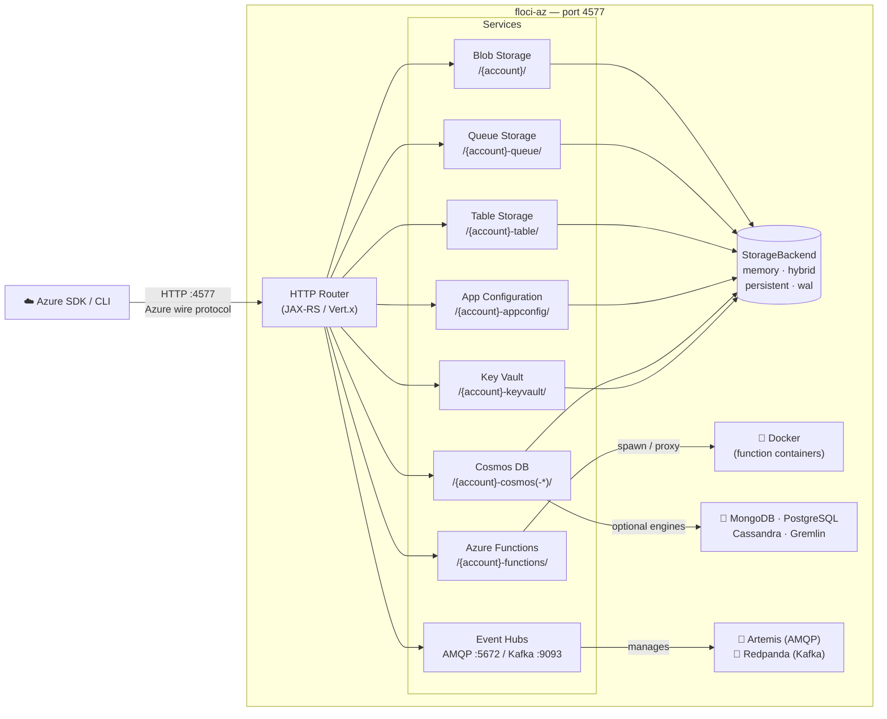

# Floci-AZ

<p align="center">
  
</p>

<p align="center"><em>Light, fluffy, and always free</em></p>

---

Floci-AZ is a fast, free, and open-source local Azure service emulator — providing Blob Storage, Queues, Tables, Azure Functions, App Configuration, Cosmos DB (all APIs), Key Vault, and Event Hubs in a single native binary.

## Why floci-az?

| | floci-az | [Azurite](https://github.com/Azure/Azurite) | [Functions Core Tools](https://github.com/Azure/azure-functions-core-tools) |
|---|---|---|---|
| Blob Storage | ✅ | ✅ | ❌ |
| Queue Storage | ✅ | ✅ | ❌ |
| Table Storage | ✅ | ✅ | ❌ |
| Azure Functions | ✅ | ❌ | ✅ |
| App Configuration | ✅ | ❌ | ❌ |
| Cosmos DB (SQL API) | ✅ | ❌ | ❌ |
| Cosmos DB (MongoDB / PostgreSQL / Cassandra / Gremlin / Table) | ✅ | ❌ | ❌ |
| Key Vault | ✅ | ❌ | ❌ |
| Event Hubs | ✅ | ❌ | ❌ |
| Startup time | **<100ms** (native image) | Moderate | Fast |
| Native binary | ✅ | ❌ | ✅ |
| Unified port (4577) | ✅ | ❌ | ❌ |
| Per-service storage modes | ✅ | ❌ | ❌ |
| WAL / hybrid persistence | ✅ | ❌ | ❌ |
| License | **MIT** | MIT | MIT |

## Architecture Overview



## Supported Services

| Service | Routing | Notable operations |
|---|---|---|
| **Blob Storage** | `/{account}/` | Create/delete containers, upload/download/delete blobs, list blobs |
| **Queue Storage** | `/{account}-queue/` | Create/delete queues, send/receive/peek/delete messages, visibility timeout |
| **Table Storage** | `/{account}-table/` | Create/delete tables, insert/get/update/upsert/delete entities, list entities |
| **Azure Functions** | `/{account}-functions/` | Deploy & invoke HTTP-triggered functions (node, python, java, dotnet); warm-container pool |
| **App Configuration** | `/{account}-appconfig/` | Key-values, labels, feature flags, snapshots, revisions, locks, ETags |
| **Cosmos DB (NoSQL)** | `/{account}-cosmos/` | Databases, containers, documents CRUD + full SQL dialect — embedded, always-on, no Docker |
| **Cosmos DB engines** | `/{account}-cosmos-{api}/` | MongoDB · PostgreSQL · Cassandra · Gremlin (Docker-backed, opt-in) · Table · NoSQL (embedded, opt-in) |
| **Key Vault** | `/{account}-keyvault/` | Secrets CRUD, versioning, soft-delete, properties update |
| **Event Hubs** | AMQP `:5672` / Kafka `:9093` | AMQP 1.0 (Artemis sidecar), Kafka-compatible (Redpanda, opt-in) |

## Quick Start

```yaml title="docker-compose.yml"
services:
  floci-az:
    image: floci/floci-az:latest
    ports:
      - "4577:4577"
    volumes:
      - ./data:/app/data
      - /var/run/docker.sock:/var/run/docker.sock  # required for Azure Functions
```

```bash
docker compose up -d
```

All services are immediately available at `http://localhost:4577`.

[Get started →](getting-started/quick-start.md){ .md-button .md-button--primary }
[View services →](services/index.md){ .md-button }
